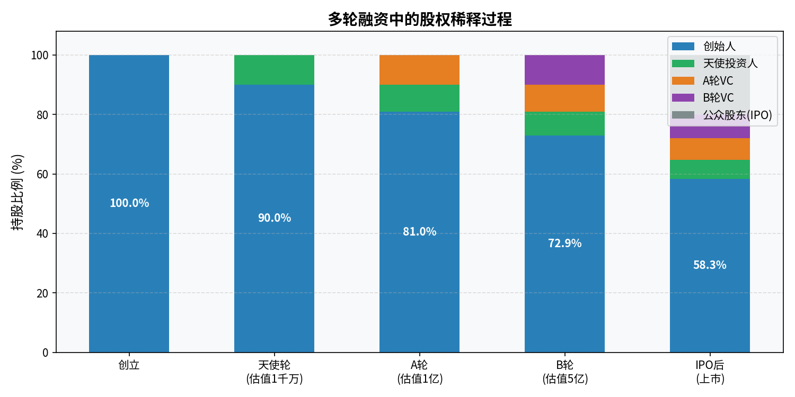

# 第二章：股票是什么

> 你买的不是一张价格会涨跌的纸，而是一家公司的一部分所有权。

---

## 2.1 公司是怎么来的：从个人到法人

假设你一个人开了个咖啡店，所有盈利归你，所有债务也由你个人承担。这叫**个人独资**。

业务扩大，你找朋友入伙，大家按出资比例分配利润和亏损，这叫**合伙企业**。

再往后，为了吸引更多投资者、限制个人连带责任，现代商业发展出了**有限公司**这种形式。

有限公司的核心设计：
- 公司是独立的**法人**，可以签合同、持有资产、承担债务
- 股东的责任**以出资额为限**，公司破产时个人财产不受牵连（有限责任）
- 公司所有权按**股份**均匀切割，持股比例决定权利大小

这套设计让大规模的商业协作成为可能——陌生人可以共同投资一家公司，而不需要彼此完全信任。

---

## 2.2 股权与股份：把公司切成一块块

**股权**是对公司资产和利润的所有权主张。

**股份**是股权的计量单位。假设一家公司总共发行 1000 万股，你持有 100 万股，你就拥有这家公司 10% 的股权。

> Q：这里的发行多少股是什么决定的，想发多少就发多少吗？
>
> A：**总股本由公司自己决定，但不是随意的，有几个约束：**
>
> **1. 成立时：公司章程决定"注册资本"和"总股本"**
> 创始人在起草公司章程时约定总股本（比如 1000 万股），以及每股面值（A 股通常是 1 元/股）。这个数字本身可以填任意值，但要与实际出资额对应——你说注册资本 1000 万、总股本 1000 万股，就需要真的出资 1000 万元进来，否则是虚假出资，违法。
>
> **2. 上市时：发行多少新股受监管严格审查**
> IPO 要向证监会申报，监管机构会审核"你打算发多少股、定价多少、募集多少资金"是否合理——不能漫天要价。发行价 × 新发股数 = 募集资金，这笔钱必须有对应的项目用途（扩产、研发、还债等），不能说"我就是想多融点"。
>
> **3. 上市后：增发新股也受约束**
> 已上市公司想增发新股（稀释现有股东权益），需要股东大会批准 + 监管审批，且必须披露募集用途。滥发新股会引发现有股东强烈反对，因为每新发一股，原股东的持股比例就被稀释。
>
> **总结：总股本数字本身是公司自定的，但背后的出资、用途、价格都受法律和监管约束，不是随便填个数字那么简单。** 股票数量只是个计量单位，真正重要的是每股代表的"公司所有权比例"——1000 万股里持有 100 万股，和 1 亿股里持有 1000 万股，持股比例（10%）完全一样，权利相同。

用程序员的比喻：一家公司就是一个资源池（资产、现金流、员工、技术），股票是这个资源池的访问令牌，持股比例是你的权限级别。

公司的股份分配会反映在**股权结构**上，通常是这样的：

```
创始人团队    ：40%
早期投资人    ：20%
员工期权池    ：10%
上市后公众股东：30%
```

上市之前的股权转让局限于私募，流动性差。上市之后，股票可以在交易所自由买卖，流动性大幅提升。

> Q：未上市前有些公司会给员工发"期权"，这和股票有什么区别？
>
> A：**期权不是股票，是"未来以固定价格买入股票的权利"。**
>
> 举个例子：公司给你 1 万份期权，行权价 5 元/股，4 年归属。这意味着：
> - 4 年后你有权利用 5 元/股的价格买入这 1 万股
> - 如果公司上市后股价涨到 50 元，你以 5 元行权，立刻值 45 万元
> - 如果公司倒闭或股价跌到 5 元以下，期权一文不值，但你也不亏本金（因为你没真的掏钱买股票）
>
> **和股票的核心区别：**
>
> | | 股票 | 期权 |
> |---|---|---|
> | 你拥有的 | 公司所有权（当下） | 未来以固定价格买入的**权利** |
> | 需要付钱吗 | 买入时付钱 | 归属前不用付钱，行权时才付行权价 |
> | 股东权利 | 有分红权、投票权 | 归属前没有任何股东权利 |
> | 风险 | 股价下跌亏损 | 最多归零，不倒亏 |
>
> **归属（Vesting）是关键概念。** 期权通常有归属期，典型是"4 年归属，1 年悬崖"：入职满 1 年才归属 25%，之后每月归属 1/48。如果你干了 11 个月离职，一份期权都没有。这是公司用来留人的机制。
>
> **未上市公司的期权有一个特殊风险**：没有流动性。股票在交易所随时可以卖，但未上市公司的期权即使归属、行权，你拿到的也是私有公司的股份，无法自由出售，必须等到上市或被收购才能变现。有些公司一直不上市，期权就永远是"纸面财富"。

---

## 2.3 为什么公司要上市

上市（IPO，Initial Public Offering）对公司的意义：

**1. 大规模融资**
上市可以一次性从成千上万的投资者手中募集大量资金，用于扩张、研发、收购。这是银行贷款难以比拟的融资规模。

**2. 为早期投资者提供退出通道**
创始人、风险投资机构持有的股权是"纸面财富"，上市后可以在二级市场出售套现。

**3. 提升公司公信力**
上市公司需要定期披露财务报告，接受监管机构审查，这种透明度提升了外部对公司的信任度。

**4. 员工激励**
期权和股权激励在上市后有了明确的市场价值，是吸引和留住人才的重要工具。

**公司为什么不上市？**

上市的代价是：信息强制公开、监管合规成本高、短期业绩压力大。很多优秀公司（如老干妈、华为）选择不上市，保持私有制经营的灵活性。

> Q：华为不上市，那它怎么给员工分红？
>
> A：华为有一套独特的**内部虚拟股**机制，本质上是"让员工分享公司利润，但不给真实股权"。
>
> **持股结构**：华为约 98.6% 的股权由"华为投资控股工会委员会"代持，任正非个人持股约 0.75%。员工持有的不是真正意义上的公司股份，而是工会委员会分配的**虚拟受限股（Virtual Restricted Shares）**。
>
> **获取方式**：员工达到一定级别后，公司每年按内部估值价格向员工配售虚拟股，员工需要真实掏钱购买（不是白给）。不同职级有持股上限，称为"饱和配股"。
>
> **分红**：华为每年根据经营利润向持股员工分红，历史上分红收益率相当可观（部分年份股息率高达 20–30%），是员工收入的重要组成部分。
>
> **退出**：员工离职时，须将持有的虚拟股按当年内部估值价格卖回给公司，不能转让给第三方，也没有公开市场定价。
>
> **和上市公司股票的本质区别**：
> - 没有公开市场，流动性完全依赖华为内部
> - 价格由华为自行每年估值，不受市场供需影响
> - 员工无法通过二级市场套现，只能等公司回购
>
> 这套机制让华为既能用利润激励核心员工，又不用向外部公开财务数据、不受股价短期波动干扰——这正是华为选择不上市的核心逻辑之一。

---

## 2.4 IPO 是什么：从私有到公开的过程

IPO 是公司**首次公开发行股票**的过程，核心步骤如下：

1. **聘请投行做承销**：投行（如高盛、中信证券）负责评估公司价值、确定发行价、向机构投资者路演
2. **向监管机构申报**：A 股需向证监会报送招股说明书并审核（注册制下审核周期缩短）
3. **询价与定价**：向机构投资者询价，确定发行价格
4. **公开申购**：面向公众投资者开放申购（A 股打新）
5. **上市交易**：股票在交易所挂牌，进入二级市场自由流通

**一级市场 vs 二级市场**

| | 一级市场 | 二级市场 |
|---|---|---|
| 定义 | 股票首次发行 | 股票在投资者间流通 |
| 资金流向 | 进入公司账户 | 在买卖双方之间转移 |
| 参与方式 | 打新、询价配售 | 每天在交易所买卖 |

**日常炒股是在二级市场**，你把钱打给了卖给你股票的那个人，公司本身不收到这笔钱。

---

## 2.5 股票的权利：分红权、投票权、清算权

持有股票意味着你拥有三项基本权利：

### 分红权
公司盈利后，董事会可以决定将部分利润以**现金股息**的形式发放给股东，按持股比例分配。

不是所有公司都会分红。成长型公司通常把利润留存再投资（比如早期的亚马逊），成熟型公司（如银行、电力）才有稳定的分红。

### 投票权
股东大会上，股东可以对重大事项投票（选举董事会、批准重大并购、修改公司章程等）。普通散户持股比例极低，投票权实际影响力微乎其微。

### 清算权
公司破产清算时，资产变现后按顺序偿还：**债权人优先，股东最后**。如果公司资不抵债，股东可能一分钱拿不回来。

这三条权利的直接含义：**股票的价值最终来源于公司的盈利能力**。一家长期亏损、不分红、资产不断缩水的公司，其股票在理论上应该趋向于零。

---

## 2.6 普通股与优先股的区别

**普通股（Common Stock）**：大多数人买的就是这个。

- 投票权：有
- 分红：不固定，董事会决定
- 清算顺序：排在优先股后面

**优先股（Preferred Stock）**：

- 投票权：通常没有
- 分红：固定比例，优先于普通股
- 清算顺序：优先于普通股，但仍然排在债权人后面

优先股更接近债券的特性——收益固定但上限有限。普通投资者在二级市场接触到的几乎都是普通股。

**同股不同权（双重股权结构）**

部分科技公司（谷歌、阿里、小米）上市时采用双重股权结构：创始人持有的 B 类股拥有 10 倍甚至更多投票权，外部投资者持有的 A 类股投票权较弱。这是保证创始人控制权的一种机制。

---

## 2.7 股票的本质价值：公司未来现金流的折现

一支股票的**内在价值**等于什么？

金融理论的答案是：**这家公司未来所有现金流折算到今天的总和**。

用公式表达：

$$P = \sum_{t=1}^{\infty} \frac{CF_t}{(1+r)^t}$$

其中：
- $CF_t$ = 第 t 年公司产生的自由现金流
- $r$ = 折现率（反映风险和资金时间价值）
- $P$ = 内在价值

这个思路叫**DCF（Discounted Cash Flow，现金流折现）模型**，是巴菲特等价值投资者的核心框架。第七章会详细讲。

现在只需要记住两个直觉：

1. **公司未来赚钱越多、增长越快，股票价值越高**
2. **未来越不确定，折现率越高，现值越低**

股价每天的涨涨跌跌，本质上是市场上所有参与者对"这家公司未来能赚多少钱"这个问题的实时集体投票。

---

## 2.8 初创公司的融资之路

上市是公司融资的终点站之一，但在上市之前，大多数公司已经经历了多轮私募融资。理解这个过程，能帮你看清楚一家公司的股权是怎么一步步被稀释和定价的。

### 融资的对象：谁在给初创公司钱

| 阶段 | 融资来源 | 典型金额 | 投资逻辑 |
|---|---|---|---|
| 天使轮 | 天使投资人（高净值个人） | 几十万–几百万 | 赌人、赌方向，极早期 |
| Pre-A / A 轮 | 风险投资基金（VC） | 数百万–数千万 | 验证了初步模型，赌增长 |
| B / C 轮 | VC + 成长期基金 | 数千万–数亿 | 规模化扩张，赌市场份额 |
| D 轮及以后 | 私募股权（PE）、主权基金 | 数亿以上 | 接近上市，降低风险 |
| IPO | 公众投资者 | 规模最大 | 公开市场定价，提供流动性 |

每一轮融资，公司都以当时的估值**新发行一部分股份**卖给投资人，换取资金。例如：

```
创始之初：创始人持有 100%
天使轮融资 100 万，估值 1000 万 → 出让 10% → 创始人剩 90%
A 轮融资 1000 万，估值 1 亿   → 出让 10% → 创始人剩 81%
B 轮融资 5000 万，估值 5 亿   → 出让 10% → 创始人剩 73%
IPO 公开发行 20%              → 创始人剩 58%
```

每一轮融资都在稀释早期股东，但同时估值也在上涨——稀释的是**比例**，增长的是**绝对价值**。



### 融资过程：一次 A 轮融资长什么样

1. **创始人路演（Pitch）**：向多家 VC 讲故事——市场有多大、产品解决什么问题、团队为什么行
2. **尽职调查（Due Diligence）**：VC 审查财务、法律、技术、竞争格局，约 1–3 个月
3. **条款清单（Term Sheet）**：VC 给出意向投资条款，包括估值、金额、投票权、反稀释条款等
4. **谈判与签署**：双方就关键条款博弈，最终签署正式协议
5. **交割**：资金进入公司账户，投资人获得股权证书

整个过程通常需要 3–6 个月，烧钱快的公司往往一边融资一边担心钱不够用。

### 估值是怎么定的

早期公司没有利润可以参考，估值更多靠**讲故事和市场参照**：

- 同赛道类似公司的融资估值
- 团队背景和经历（名校、大厂、连续创业者溢价）
- 用户增长数据（DAU、GMV、留存率等）
- 市场规模（TAM）的故事

早期估值很主观，同一家公司不同 VC 给出的估值可能相差 2–3 倍。**估值不等于公司真实价值，只是当下买卖双方协商的结果。**

---

### 三种结局：对公司和投资人的影响

#### 结局一：公司倒闭

这是最常见的结局。统计上，约 **90% 的初创公司最终失败**。

**对投资人**：按清算顺序依次偿还。优先股投资人（VC 通常持有优先股）优先于普通股，但如果公司资产远不够偿还债务，股权投资人通常颗粒无收。早期天使和员工期权价值归零。

**对创始人**：股权价值归零。但如果公司债务没有由创始人个人担保（有限公司制度的保护），个人资产通常不受牵连。

**对员工**：期权归零，工资结算取决于公司剩余资产。

> 这就是风险投资"高风险高回报"的逻辑——VC 投 10 家公司，预期 7 家打水漂，2 家平盘，1 家回报 100 倍，整体才能赚钱。

---

#### 结局二：公司一直不上市（持续私有）

有些公司盈利稳健但不愿意上市（华为、IKEA、彭博），或者长期处于"准备上市"状态。

**对投资人**：资金长期被锁定，无法退出。VC 基金通常有固定存续期（7–10 年），必须退出。若公司不上市，只能寄望于：
- **并购退出**：公司被大公司收购，投资人随之套现（最常见的 VC 退出方式）
- **股权转让**：在私募二级市场将股份卖给其他机构（流动性差，折价出售）
- **公司回购**：公司用自有资金回购投资人股份

**对早期员工**：期权虽已归属，但无法变现。若公司长期不上市，期权的行权成本可能超过意义——尤其是需要提前掏钱行权却无法变现的情况下。

**对公司本身**：保持完全的经营自主权，无需向公众披露财务数据，不受季度业绩压力干扰。适合长期主义的创始人。

---

#### 结局三：IPO 上市

**对投资人**：
- IPO 时通常有 **6 个月锁定期（Lock-up Period）**，禁止早期股东立刻抛售，防止上市即砸盘
- 锁定期结束后，VC 和早期投资人开始逐步减持退出
- 回报倍数 = 退出价格 / 当年入股成本。一个好的项目回报 10–100 倍，覆盖基金里其他失败项目的损失

**对创始人**：
- 持股部分可以在锁定期后减持套现，但大规模减持会引发市场对"创始人不看好公司"的担忧，通常分批缓慢进行
- 同时承受公众公司的监管压力：季报、年报、分析师追问、媒体监督

**对员工**：
- 已归属的期权可以行权后在二级市场出售，多年的"纸面财富"变成真实收入
- 这一刻是很多早期员工最直接的财富兑现时刻

**对公众投资者（你）**：
- IPO 首日可以参与"打新"（A 股）或在开盘后二级市场买入
- 上市初期往往波动剧烈，早期投资人的锁定期解禁是重要的卖压节点，需要注意

> Q：IPO 首日参与"打新"的条件是什么？
>
> A：A 股打新有一套独特的规则，和美股直接开盘买入不同。
>
> **基本条件**：
> - 持有有效的 A 股证券账户
> - 申购前 20 个交易日（T-20 至 T-1）日均持有沪市或深市的**市值达到一定门槛**
>   - 沪市主板新股：每 1 万元沪市市值可申购 1000 股，最多 1 万股（即最少需持有 1 万元沪市股票/ETF）
>   - 深市（含创业板）：规则类似，按深市市值配给申购额度
>   - 科创板：另需开通科创板权限，且要求 50 万资产 + 2 年投资经验
>
> **申购流程**：
> 1. 新股申购日（T 日）在规定时间内（通常 9:30–11:30 / 13:00–15:00）提交申购
> 2. 每个账户每只新股只能申购一次，超额申购无效
> 3. T+1 日摇号中签，中签结果在 T+2 日公布
> 4. 中签后需在规定时间内缴款，否则视为放弃
>
> **中签率有多低？**
> 热门新股中签率通常在 0.01%–0.1% 之间，中一签（100–500 股）需要申购几千到几万个账户才有一次中签机会。散户打新更多是"买彩票"的性质。
>
> **打新的收益逻辑**：
> A 股新股上市首日历史上大多有涨幅（部分新股有涨幅限制），中签即可在首日卖出获利。但 2023 年注册制全面推行后，新股上市首日破发（跌破发行价）的情况明显增多，打新不再是稳赚不赔的游戏，需要评估具体新股的质地。
>
> **美股/港股打新**：没有市值门槛要求，通过券商直接参与申购即可，但分配逻辑不同——机构优先，散户能拿到的份额极少，且热门新股通常散户根本分不到。
---

### 一张图看清全貌

```
创立
  │
  ├─ 天使/种子轮：少数人相信，给第一笔钱
  │
  ├─ A/B/C 轮：VC 跟进，公司快速扩张，每轮稀释但估值上升
  │
  ├─ Pre-IPO：战略投资者、PE 进入，为上市铺路
  │
  └─ 分叉点
        ├─ IPO → 公众可买卖，早期投资人逐步退出
        ├─ 被收购 → 按协议现金或换股退出
        ├─ 持续私有 → 靠分红或股权转让退出
        └─ 倒闭 → 清算，大概率颗粒无收
```

---

## 本章小结

| 概念 | 核心要点 |
|---|---|
| 有限公司 | 法人独立，股东有限责任 |
| 股票 | 公司所有权的计量单位 |
| IPO | 公司首次向公众发行股票，进入二级市场 |
| 股东权利 | 分红权 + 投票权 + 清算权（顺序最后） |
| 股票价值 | 公司未来所有现金流的折现之和 |

---

**下一章** → [第三章：交易所与市场结构](chapter3.md)
