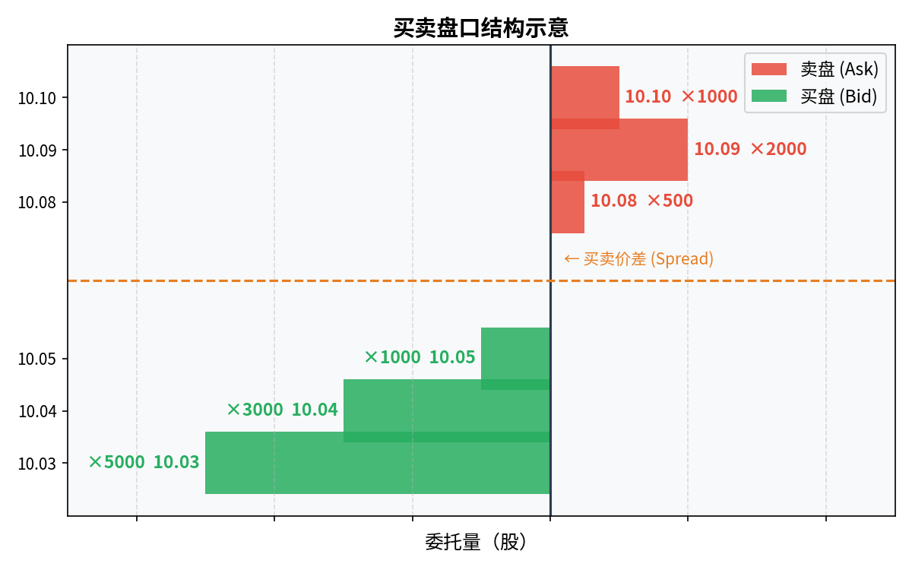

# 第三章：交易所与市场结构

> 股票不是在真空中交易的。理解它在哪里交易、规则是什么，才能理解价格是怎么形成的。

---

## 3.1 交易所的作用：集中撮合与价格发现

在没有交易所的时代，买卖股票需要双方自己找到对方，谈妥价格，效率极低，且容易被中间人操控。

交易所解决了这个问题，它提供两项核心功能：

**集中撮合**：把所有想买和想卖的人集中在同一个平台，按规则自动匹配。你不需要认识对方，不需要谈判，挂单即可。

**价格发现**：无数买卖订单汇集之后，在某个价格上供需达成平衡，这个价格就成为市场对这家公司当前价值的最优估计。这个过程叫价格发现。

交易所同时承担监管职能：上市公司需要满足信息披露要求，违规行为会被查处。

---

## 3.2 中国市场：沪深交易所、北交所

中国大陆有三家证券交易所：

### 上海证券交易所（SSE）
- 简称**沪市**
- 主要上市大型国企、金融企业、蓝筹股
- 代表指数：上证指数（000001）、上证 50（SSE 50）
- 股票代码以 **6** 开头（如工商银行 601398）

### 深圳证券交易所（SZSE）
- 简称**深市**
- 历史上更多中小企业、科技公司、成长型公司
- 包含：主板（代码以 0 开头）、创业板（GEM，代码以 3 开头）
- 代表指数：深证成指、创业板指

### 北京证券交易所（BSE）
- 2021 年成立，服务**中小创新型企业**
- 定位介于沪深主板和新三板之间
- 流动性目前相对较低，投资者需另行开通权限

**A 股 vs B 股**

A 股面向境内投资者，以人民币计价，是主流。B 股历史遗留产品，以外币计价，交易冷清，基本可以忽略。

---

## 3.3 美国市场：NYSE、NASDAQ 与场外市场

### 纽约证券交易所（NYSE）
- 全球最大证券交易所，按市值计算
- 上市门槛高，多为传统行业大公司（可口可乐、摩根大通）
- 采用"做市商 + 竞价"混合机制


> Q：什么叫做市商？什么是竞价？
>
> A：这是两种完全不同的"买卖双方如何撮合成交"的机制。
>
> **竞价机制（Order-Driven）**
>
> <u>买卖双方直接挂单，系统按"价格优先、时间优先"自动匹配。没有中间人，价格完全由市场供需决定。</u>**A 股采用的就是这种机制。**
>
> 类比：像一个公开拍卖现场，所有人喊出自己的出价，价格最高的买家和价格最低的卖家自动成交。
>
> ```
> 卖盘（Ask）            买盘（Bid）
> 10.08 × 500 股        10.05 × 1000 股
> 10.09 × 2000 股       10.04 × 3000 股
> 10.10 × 1000 股       10.03 × 5000 股
> ```
> 当你下一个市价买单，系统从最低卖价 10.08 开始成交，500 股吃完再吃 10.09 的 2000 股，直到你的买单全部成交。
>
> **做市商机制（Quote-Driven）**
>
> <u>有一个专门的"做市商"机构（通常是大型投行或券商），它**同时报出买价和卖价**，随时准备和任何人成交。你不需要等另一个真实买家或卖家出现，做市商就是你的对手方。</u>
>
> 类比：像一个二手车行，老板挂牌"收车价 9.8 万，卖车价 10 万"，你随时可以按这个价格买卖，不用等另一个有车的人出现。
>
> 做市商的收入来源就是买卖价之间的**价差（Spread）**——以 9.8 万收进来，以 10 万卖出去，每笔赚 2000 元。
>
> **两种机制的对比：**
>
> | | 竞价机制 | 做市商机制 |
> |---|---|---|
> | 对手方 | 另一个真实的买家/卖家 | 做市商 |
> | 成交保证 | 不保证（没人接单就挂着） | 保证（做市商随时接单） |
> | 价格决定 | 完全由供需决定 | 做市商报价，略有主动权 |
> | 适用场景 | 流动性好、参与者多的市场 | 流动性差、参与者少的市场 |
> | 代表 | A 股、B 股 | 早期纳斯达克、债券市场 |
>
> 现实中两种机制常常混合使用。NYSE 就是典型的混合模式：有竞价撮合，也有"指定做市商（DMM）"在极端行情时维护市场秩序、防止价格剧烈波动。

### 纳斯达克（NASDAQ）
- <u>以科技公司为主（苹果、微软、谷歌、亚马逊均在此上市）</u>
- 完全电子化交易，无实体交易大厅
- 上市门槛相对 NYSE 更低，适合成长型科技公司

### 场外市场（OTC）
小公司或不满足交易所上市要求的公司在此交易，流动性低、信息透明度差，风险较高，初学者不建议涉足。

**美股特点**：
- 无涨跌停限制
- T+0 交易（当天买当天可卖）
- 面向全球投资者，流动性极强
- 时区差异：美东时间 9:30–16:00（北京时间约 22:30–次日 5:00）

---

## 3.4 港股市场：联交所与互联互通

**香港联合交易所（HKEX）**是亚洲主要交易所之一，特点：

- 国际化程度高，连接中国内地与全球资本
- 大量中国内地公司在此上市（腾讯、美团、快手）
- 以港币计价，无涨跌停限制
- T+2 交收（买入后第二个工作日完成结算）

**互联互通（沪深港通）**

自 2014 年起，内地投资者可以通过**沪港通、深港通**直接买卖港股（在一定额度和范围内），香港投资者也可以买 A 股，无需另开港股账户。

操作上：在证券公司开通港股通权限即可，但需要注意港股通可购买的标的不覆盖全部港股。

> Q：沪港通、深港通是什么？内地投资者怎么买卖港股？额度和范围大概是怎样的？
>
> A：
>
> **是什么**
>
> 沪港通（2014 年开通）和深港通（2016 年开通）是连接内地与香港证券市场的互联互通机制，本质是在两地各设一条"管道"：
> - <u>**北向**（北上）</u>：香港及境外投资者通过沪股通/深股通买卖 A 股，资金向北流入内地
> - <u>**南向**（南下）</u>：内地投资者通过港股通买卖香港上市股票，资金向南流入香港
>
> 日常说的"北向资金"（也叫"北上资金"）指境外/香港资金买 A 股；"南向资金"（也叫"南下资金"）指内地资金买港股。
>
> **内地投资者如何操作**
>
> 1. 在已有的 A 股证券账户中申请开通"港股通"交易权限
> 2. 券商要求：资产不低于 **50 万元人民币**（前 20 个交易日日均资产），且需完成港股通风险测评
> 3. 开通后直接在券商 APP 内搜索港股代码（如腾讯 00700）下单，用人民币结算，无需换汇
> 4. 结算汇率每日由中国结算公司公布，自动完成人民币与港币的兑换
>
> **可买的范围（港股通标的）**
>
> 港股通并不能买全部港股，覆盖范围如下：
>
> | 通道 | 可买标的 |
> |---|---|
> | 沪港通·港股通 | 恒生综合大型股指数、中型股指数成分股 + 在港沪两地同时上市的 A+H 股，约 500 只 |
> | 深港通·港股通 | 恒生综合小型股指数成分股（市值 50 亿港币以上）+ A+H 股，约 500 只 |
>
> 两个通道合并覆盖约 **800–900 只**港股（部分重叠），占港股总数约 2500 只的三分之一。主要蓝筹和中大市值股基本都在范围内（腾讯、美团、小米、汇丰、友邦等），但大量中小市值港股、部分 B 类股、新上市未纳入的股票不在名单内。
>
> **每日额度**
>
> 沪深港通设有每日额度上限（总额度）：
> - 北向（内地→港股）：每日额度 **520 亿港元**（沪港通 + 深港通合计）
> - 南向（港股→A 股）：每日额度 **420 亿人民币**
>
> 实际上每日额度极少用完，对普通散户没有实质影响。额度耗尽时当日暂停新买单，但已持仓的卖出不受限制。
>
> **和直接开港股账户相比**
>
> | | 港股通 | 独立港股账户（富途/盈透） |
> |---|---|---|
> | 门槛 | 50 万人民币资产 | 无资产门槛 |
> | 可买标的 | 约 800–900 只 | 全部港股 |
> | 汇率风险 | 自动换汇，有汇差 | 自行持有港币，可规避汇差 |
> | 操作便利 | 在原有 A 股 APP 内操作 | 需另开账户 |
> | 资金安全 | 中国结算托管，监管清晰 | 取决于券商所在地监管 |
>
> 结论：**只想买腾讯、美团等主流港股，港股通足够**；需要覆盖全部港股或买港股 IPO 打新，则需要单独开港股账户。
>
> Q：港股 IPO 打新没有资产要求吗？中签率大概是多少？和 A 股打新相比有什么不同？
>
> A：港股打新和 A 股打新在机制上差异很大，整体对散户更友好，但也有自己的坑。
>
> **资产要求**：几乎没有。通过富途、老虎、盈透等港股券商开户后即可参与，无最低持仓市值要求。唯一门槛是认购资金本身——你需要在申购期间冻结认购金额。
>
> **申购流程**：
> 1. 在招股期间（通常 3–5 个工作日）向券商提交认购意向，填写认购手数（1 手 = 该股规定的最小单位，通常 200–2000 股不等）
> 2. 资金在认购期间被冻结，不影响其他持仓
> 3. 暗盘交易（上市前一天晚上，部分券商支持）可以提前交易
> 4. 正式上市日开盘后可自由买卖
>
> **中签率（港股叫"抽签"）**：
>
> 港股打新采用**比例分配**而非摇号，大多数情况下申购的散户都能拿到至少 1 手：
> - 热门新股：认购倍数高（100 倍以上），按比例回拨，最终散户获配比例极低，可能几百人里才有 1 人拿到 1 手
> - 一般新股：认购倍数低，申购人数少，拿到 1 手概率较高，有时接近 100%
>
> **和 A 股打新的核心区别**：
>
> | | A 股打新 | 港股打新 |
> |---|---|---|
> | 参与门槛 | 需持有对应市场 1 万元以上市值 | 无市值要求，冻结认购金即可 |
> | 分配方式 | 摇号，中签是运气 | 比例分配，热门股回拨后按比例获配 |
> | 是否需要自掏资金 | 中签后才需缴款 | 申购时即冻结资金，未中签后解冻 |
> | 上市首日涨幅 | 历史上大多有涨幅，但注册制后破发增多 | 无涨跌停限制，暴涨暴跌都有先例 |
> | 打新收益稳定性 | 注册制前几乎稳赚，之后风险上升 | 历来风险较高，破发是常态 |
> | 暗盘 | 无 | 部分券商支持上市前一天晚上暗盘交易 |
>
> **港股打新最大的风险**：破发。港股没有涨跌停保护，新股上市首日直接跌破发行价是家常便饭，尤其是市场低迷时期。2022 年港股熊市期间，大量新股上市当天跌幅超过 20%，申购资金直接损失。
>
> **结论**：港股打新不是"稳赚"策略，需要判断个股质地和市场环境，热门优质新股值得参与，普通新股应谨慎。

---

## 3.5 做市商与竞价机制：你的订单如何成交

市场上有两种主要的撮合机制：

### 竞价机制（Order-Driven）
买卖双方直接报价，系统按**价格优先、时间优先**原则自动撮合。
- A 股采用此机制
- 价格完全由供需决定
- 买价（Bid）和卖价（Ask）之间的差叫**买卖价差（Spread）**

运作逻辑：
```
买盘（Bid）          卖盘（Ask）
  10.05 × 1000       10.08 × 500
  10.04 × 3000       10.09 × 2000
  10.03 × 5000       10.10 × 1000
```
当你下一个市价买单，系统从最低卖价开始吃单（10.08 起）。



### 做市商机制（Quote-Driven）
做市商（Market Maker）持续报出买价和卖价，随时与投资者交易，保证市场流动性。
- 纳斯达克历史上采用此机制，现在是混合模式
- 做市商赚取买卖价差
- 好处是小额订单总有对手方，坏处是价差可能较大

---

## 3.6 涨跌停板制度：A 股的特殊规则

A 股实行**涨跌停限制**，这是与美股、港股最显著的规则差异：

| 市场板块 | 涨停限制 | 跌停限制 |
|---|---|---|
| 沪深主板 | +10% | -10% |
| 科创板、创业板 | +20% | -20% |
| 北交所 | +30% | -30% |
| 新股上市首日 | 无限制或宽松限制 | |

**涨停/跌停的含义**：

- 当日最高只能涨到前一收盘价的 110%（主板），超过这个价格的买单无法成交
- 达到涨停价后仍可挂单，但只能按涨停价排队，先到先得

**封板与开板**：涨停后如果大量买单持续涌入，涨停板被"封住"；若有大量卖单砸盘，涨停板被"打开"，是重要的盘口信号。

**对投资者的影响**：
- 涨跌停导致极端行情下可能**无法买入或卖出**，流动性风险真实存在
- 连续一字涨停/跌停的股票，想卖出可能需要等好几天

---

## 3.7 交易时间、T+1 与结算周期

### <u>A 股交易时间</u>

| 阶段 | 时间 | 说明 |
|---|---|---|
| 集合竞价（开盘前） | 9:15–9:25 | 接受报单，9:25 集中撮合，确定开盘价 |
| 连续竞价（上午） | 9:30–11:30 | 正常交易时段 |
| 午休 | 11:30–13:00 | 不交易 |
| 连续竞价（下午） | 13:00–14:57 | 正常交易时段 |
| 尾盘集合竞价 | 14:57–15:00 | 集中撮合，确定收盘价 |


> Q：什么是集合竞价？什么是连续竞价？9:15–9:25 和 14:57–15:00 的集合竞价有什么不同？接受报单是什么意思？
>
> A：
>
> **接受报单**：就是允许你提交买入或卖出的委托单，但不一定立刻撮合成交。可以理解为"系统开始收单，但还没开始处理"。
>
> ---
>
> **集合竞价（Call Auction）**
>
> 在一段时间内先收集所有挂单，最后统一用一个价格撮合——这个价格让成交量最大化，叫**集合竞价定价**。
>
> 核心特点：**所有挂单同时被处理，不存在先来先得，最终所有人用同一个价格成交。**
>
> 定价逻辑（系统自动计算）：找到一个价格 P，使得"愿意以 ≤P 价格买入的量"和"愿意以 ≥P 价格卖出的量"的重叠部分（成交量）最大。
>
> 举例：
> ```
> 挂单情况：
>   买单：10.05 × 3000，10.04 × 2000，10.03 × 1000
>   卖单：10.03 × 1000，10.04 × 2000，10.05 × 3000
>
> 在 10.04 价位：愿意买的有 5000 股（≤10.04），愿意卖的有 3000 股（≥10.04）
> 在 10.03 价位：愿意买的有 6000 股，愿意卖的有 1000 股
> 在 10.05 价位：愿意买的有 3000 股，愿意卖的有 6000 股
> → 10.04 时成交量最大（3000 股），开盘价定为 10.04
> ```
> 所有在集合竞价阶段挂单、且价格满足条件的委托，都以 10.04 统一成交。不满足条件的委托，则取消。
>
> ---
>
> **连续竞价（Continuous Auction）**
>
> 9:30 之后进入连续竞价：每一笔新挂单进来，系统立刻和已有的对手方撮合，**先来先得，即时成交**。这是正常交易时段的运作方式。
>
> 逻辑：你挂一个限价买单 10.05，如果当前最低卖价 ≤10.05，立刻成交；否则挂在买盘等待。
>
> ---
>
> **开盘集合竞价（9:15–9:25）和收盘集合竞价（14:57–15:00）的区别**
>
> | | 开盘集合竞价 | 收盘集合竞价 |
> |---|---|---|
> | 时间 | 9:15–9:25 | 14:57–15:00 |
> | 目的 | 确定**开盘价** | 确定**收盘价** |
> | 可否撤单 | 9:15–9:20 可撤，9:20 后**不可撤** | **全程不可撤单** |
> | 参与挂单的人 | 昨晚或早上挂的单 + 9:15 后新挂单 | 14:57 前已挂的单 + 14:57 后新挂的单 |
> | 成交规则 | 集合竞价定出唯一开盘价，统一成交 | 同左，定出收盘价 |
>
> **9:20 后不可撤单**是关键细节：9:15–9:20 期间你可以反悔撤单，9:20 后挂出去的单就锁定了，直到 9:25 集合撮合。这是为了防止最后一秒大量撤单操纵开盘价。
>
> **收盘价的重要性**：收盘价是当天"官方价格"，是次日计算涨跌停基准价的依据，也是各类指数和基金净值的计算基准。因此 14:57–15:00 这三分钟的集合竞价是每天最容易被机构"打价格"的时间段，散户应特别注意。
>
> Q2：如何避免 14:57–15:00 这三分钟的集合竞价被机构"打价格"干扰？
>
> A：先理解机构为什么要"打价格"，才能知道对你的实际影响有多大。
>
> **机构为什么要在收盘前打价格？**
>
> 常见动机有两种：
> - **压低收盘价**：机构持有大量仓位，但基金净值按收盘价计算。若想让某天的净值回撤看起来小一些，或者为明天制造低开高走的走势，就在 14:57 后集中砸盘压低收盘价
> - **拉高收盘价**：做市值管理，让持仓股收盘价好看；或在月末/季末"粉饰"净值（俗称"window dressing"）
>
> **对普通散户的实际影响**
>
> 坦白说，**大多数时候影响有限**，原因是：
> - 打价格需要大量资金，成本高，不是每天都发生
> - 尾盘异常波动往往只影响收盘价，第二天开盘价通常会修正回来
> - 对长期持有者而言，某一天的收盘价偏差 0.5% 几乎可以忽略
>
> **真正需要注意的场景**
>
> 1. **你打算在收盘前挂单卖出**：如果某只股票 14:57 后突然有大单砸盘，你的限价卖单可能以明显低于 14:56 价格的价位成交。应对方式：**在 14:57 之前完成卖出操作**，避开尾盘集合竞价。
>
> 2. **ETF 申赎套利者关注收盘价偏差**：ETF 的净值按成分股收盘价计算，若有股票尾盘被打压，当天 ETF 净值会低于真实价值，次日通常回归。这是机构套利的空间，散户一般不需要参与。
>
> 3. **月末/季末的收盘价异常**：基金季报考核期，主动基金经理在季末最后一天收盘前拉升重仓股的情况较常见（window dressing）。这反而对持有该股的散户是利好——但次日往往回落，不要追涨。
>
> **操作建议**：
> - 不想被尾盘波动干扰，把当天的买卖操作在 14:50 前完成
> - 如果当天没有交易计划，14:57 后不要临时冲动下单——尾盘集合竞价期间**挂出去的单无法撤回**

### T+1 制度

A 股实行 **T+1 交易**：今天（T 日）买入的股票，**最早明天（T+1 日）才能卖出**。但资金是 T+0 的——今天卖出的钱当天就可以再用来买入。

美股是 T+0——买了当天就能卖。

### 结算周期

A 股：股票 T+1 过户，资金 T+1 到账（极端情况 T+2）。

**这有什么实际影响？**

追涨时需注意：今天买入后如果第二天跌停，你无法当天止损。T+1 制度降低了短线操作的灵活性，也是 A 股散户在极端行情中容易踩坑的原因之一。

> Q：今天刚买入的股票看见有跌的趋势，我立马选择卖出，能及时止损吗？还是因为 T+1 制度，我无法在今天卖出？之前某天买入的呢？
>
> A：**今天买入的，当天无法卖出。之前买入的，当天可以卖。**
>
> T+1 规则的精确含义：**同一笔股票**，买入当天（T 日）不能卖出，必须等到 T+1 日才能卖。
>
> 用表格说清楚：
>
> | 情况 | 能否今天卖出 |
> |---|---|
> | 今天（周一）刚买入的 | ❌ 不能，最早明天（周二）才能卖 |
> | 上周五买入、今天还持仓的 | ✅ 可以，随时卖 |
> | 昨天买入的 | ✅ 可以，今天是 T+1 日 |
>
> 所以你的场景：**今天买入后发现跌势，当天无法止损**，只能眼睁睁看着。这是 A 股 T+1 制度最真实的"代价"。
>
> **实际影响有多大？**
>
> 取决于买入后跌了多少：
> - 如果当天跌了 3%，你只是账面浮亏，明天开盘可以立刻挂单卖出
> - 如果当天跌停（-10%），你今天无法卖，明天开盘还可能继续下跌，甚至再次跌停
> - 极端情况：连续跌停（如黑天鹅消息），T+1 制度可能让你被迫持仓数天，越亏越深
>
> **这正是为什么追涨买入风险极高**——你在最高点买入，T+1 锁死了你当天的退路，一旦消息反转，损失就被锁定了。
>
> **ETF 的 T+1 规则相同**，同样是买入当天不能卖。
>
> **对比美股**：美股是 T+0，买了当天就能卖，止损灵活度完全不同。这也是很多程序员更喜欢美股短线操作的原因之一。

---

## 本章小结

| 概念 | 核心要点 |
|---|---|
| 交易所功能 | 集中撮合 + 价格发现 |
| A 股三所 | 上交所（大盘蓝筹）、深交所（成长科技）、北交所（中小创新） |
| 美股 | 无涨跌停、T+0、流动性强 |
| 港股 | 国际化、无涨跌停、沪深港通可互联互通 |
| 涨跌停 | A 股主板 ±10%，极端行情下可能无法交易 |
| T+1 | 今天买的股票明天才能卖，但资金当天可再用 |

---

← [第二章：股票是什么](chapter2.md) | **下一章** → [第四章：看懂大盘](chapter4.md)
