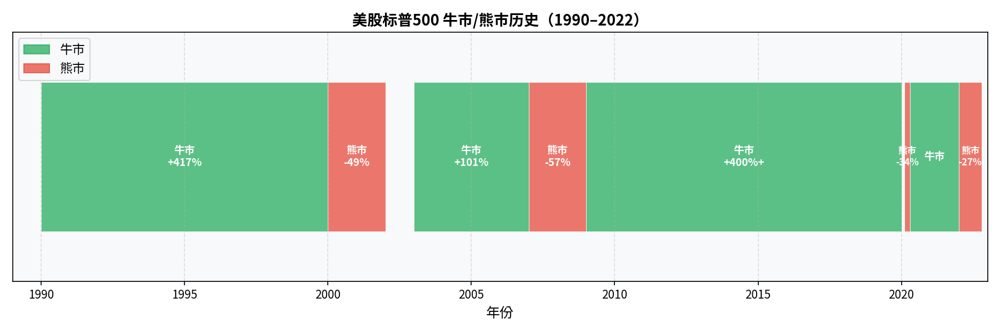

# 第四章：看懂大盘

> 在分析个股之前，先看清楚市场整体的方向。逆势而为，再好的股票也难涨。

---

## 4.1 指数是什么：用一个数字描述市场

A 股有 5000+ 只股票，怎么快速知道今天市场整体涨还是跌？

**指数**（Index）的作用就是把一篮子股票的价格变动压缩成一个数字。

构建方式：
1. 选取一组有代表性的股票（成分股）
2. 按某种权重规则加权平均
3. 以某个基期为基准（如 1000 点）计算变化

当指数从 3000 点涨到 3300 点，意味着这一篮子股票整体涨了 10%。

指数本身不能直接买卖，但**指数基金（ETF）**可以，它追踪指数表现，近乎完美地复制指数涨跌。


> Q：3000 点中的"点"是什么意思？如何理解指数的点位？
>
> A：<u>**"点"是指数的无量纲计量单位，本身没有货币含义，只代表相对于基期的变化倍数。**</u>
>
> 每个指数都有一个**基期**和**基期值**，以此为起点计算变化。
>
> 以上证指数为例：
> - 基期：1990 年 12 月 19 日（上交所开市）
> - 基期值：**100 点**
> - <u>今天上证指数约 3000 点，意味着从基期到现在，这一篮子股票的总市值增长了约 **30 倍**（3000 ÷ 100 = 30）</u>
>
> 沪深 300 指数的基期是 2004 年 12 月 31 日，基期值 **1000 点**，所以现在约 4000 点代表从 2005 年至今涨了约 4 倍。
>
> **怎么理解日常说的"3000 点"？**
>
> "3000 点"本身是个绝对数字，单独看没有太大意义。有意义的是：
> - **涨跌幅**：今天从 2980 涨到 3020，涨了 40 点，涨幅 = 40 ÷ 2980 ≈ 1.34%
> - **相对历史区间**：上证指数历史最高约 6124 点（2007 年），最低约 998 点（2008 年），3000 点大约处于历史中枢偏低位
> - **横向对比没有意义**：上证 3000 点和纳斯达克 18000 点不能直接比高低，因为基期不同、成分股不同、基期值也不同
>
> **一个常见误区**：很多人觉得"指数越高越贵、越低越便宜"。这是错的。指数点位只反映相对基期的涨幅，不反映当前估值贵不贵——判断贵不贵要看 PE、PB 等估值指标，而不是点位本身。上证 3000 点可能很便宜，也可能很贵，取决于成分股的盈利水平。
>
> Q1："上证 3000 点可能很便宜，也可能很贵，取决于成分股的盈利水平。"这句话不是很理解，上证 3000 点不是相对于基期涨了 30 倍吗？怎么能既便宜又贵呢？请举例说明。
>
> A1：关键在于——**价格涨了 30 倍，但公司的盈利也可能涨了 30 倍甚至更多**。"贵不贵"不是看价格涨了多少，而是看"你花多少钱买了多少盈利能力"。
>
> 用一个极简的例子：
>
> **场景 A：3000 点但很便宜**
> - 1990 年基期，所有成分股合计每年赚 100 亿元
> - 现在 3000 点，价格是基期的 30 倍，市值 = 3000 亿元
> - 但现在这些公司合计每年赚 600 亿元（盈利涨了 6 倍）
> - 你花 3000 亿买一个每年赚 600 亿的资产，5 年就回本，**很便宜**
>
> **场景 B：3000 点但很贵**
> - 同样 3000 点，市值 = 3000 亿元
> - 但现在这些公司合计每年只赚 30 亿元（盈利没怎么涨）
> - 你花 3000 亿买一个每年赚 30 亿的资产，100 年才回本，**非常贵**
>
> 两个场景点位相同，贵贱完全相反。**点位只告诉你价格走了多远，不告诉你现在值不值这个价。**
>
> 历史上真实发生过这种情况：2007 年上证 6000 点时，很多股票 PE 高达 60–70 倍，极度昂贵；2014 年上证 2000 点时，很多蓝筹股 PE 只有 7–8 倍，反而便宜。所以低点不一定便宜，高点不一定贵。
>
> ---
>
> Q2：PE、PB 等估值指标是什么意思？怎么计算的？为什么它们能反映股票的贵贱？
>
> A2：这两个指标都是在回答同一个问题：**你花的钱，买到了什么？**
>
> **PE（市盈率，Price-to-Earnings Ratio）**
>
> ```
> PE = 股价 ÷ 每股收益（EPS）
>    = 公司总市值 ÷ 公司年净利润
> ```
>
> 含义：你花多少钱，买了公司每年赚 1 块钱的盈利能力。
>
> - PE = 20，意思是：你花 20 元，买了公司每年赚 1 元的权利。假设盈利不变，20 年回本
> - PE = 10，同样 1 元盈利只要花 10 元，更便宜
> - PE = 100，花 100 元才买到 1 元盈利，非常贵（除非你预期盈利会快速增长）
>
> 为什么能反映贵贱？**因为你买股票的本质是买未来的盈利，PE 直接衡量了你为这份盈利付了多少价。**
>
> 实际参考值（A 股大致范围）：
> - PE < 15：偏低估，历史上往往是较好的买入区间
> - PE 15–25：合理
> - PE > 40：偏高估，需要高增长支撑，否则风险较大
>
> **PB（市净率，Price-to-Book Ratio）**
>
> ```
> PB = 股价 ÷ 每股净资产
>    = 公司总市值 ÷ 公司净资产（总资产 - 总负债）
> ```
>
> 含义：你花多少钱，买了公司账面上每 1 元的净资产。
>
> - PB = 1，意思是：市场对公司的估值恰好等于其账面净资产，按"清算价"买入
> - PB < 1（破净）：市场认为公司连账面资产都不值，可能是机会也可能是陷阱
> - PB = 3，你花 3 元买了 1 元的账面资产，溢价来自市场对品牌、技术等无形价值的认可
>
> PE 和 PB 的适用场景不同：
> - **PE** 适合盈利稳定的公司（消费、科技）
> - **PB** 适合重资产、盈利波动大的公司（银行、地产），因为这类公司净资产更能代表其真实价值
>
> **一句话总结**：PE 问的是"这份盈利能力值多少钱"，PB 问的是"这堆资产值多少钱"。两者从不同角度衡量同一件事：你花的钱是否合理。第五章和第七章会更深入地讲这两个指标的实际用法。
>
> Q：PE 与 PB 对于投资者都是越小越好吗？
>
> A：**不是。越小越好是个危险的误解。**
>
> PE 和 PB 低，可能是"便宜"，也可能是"便宜有原因"——市场在反映这家公司有真实的问题。
>
> **PE 低的三种情况，性质完全不同：**
>
> | 情况 | PE 低的原因 | 是否值得买 |
> |---|---|---|
> | 优质公司被市场暂时忽视 | 市场情绪低迷，非基本面原因 | ✅ 往往是机会 |
> | 周期股处于景气高峰 | 当期利润高，但不可持续 | ⚠️ 反而危险，明年利润可能暴跌 |
> | 公司基本面真的在恶化 | 盈利萎缩、行业被颠覆 | ❌ 估值陷阱（Value Trap） |
>
> 典型的"估值陷阱"：某传统零售公司 PE = 8，看起来很便宜，但电商正在蚕食它的市场，未来利润只会越来越少——你买的是一个正在缩水的资产，再低的 PE 也是贵的。
>
> **PE 高也不一定贵：**
>
> 一家每年利润增长 40% 的公司，PE = 50 看起来很高，但两年后利润翻了一倍，PE 自然降到 25。你买的不是现在的盈利，而是未来的盈利——这正是成长股投资的逻辑。
>
> **PB 同理：**
>
> PB < 1（破净）不代表一定便宜：
> - 如果公司的资产是优质的（土地、设备、现金），破净是机会
> - 如果资产质量差（大量坏账、过时设备、无法变现的商誉），账面净资产本身就是虚的，PB 低也没意义
>
> **正确的使用方式：**
>
> PE 和 PB 应该**纵向对比**（与该公司历史均值比）和**横向对比**（与同行业同类公司比），而不是孤立地看一个绝对数字。
>
> - 茅台 PE = 30，历史均值 35，当前偏低，可能是机会
> - 某科技公司 PE = 30，但行业平均 PE = 15，当前偏贵
>
> 一句话：**低 PE/PB 是买入的必要条件，不是充分条件。还需要确认低估的原因是暂时的、可逆的，而不是公司真的在走下坡路。**
---

## 4.2 主要指数详解

### 上证指数（000001.SH）
- <u>又称"大盘指数"、"沪指"</u>
- 覆盖上交所**全部**上市股票
- 问题：包含所有股票，烂公司也计入，导致指数长期被拖累；且以总股本加权，大量不流通的国有股压低了有效性
- 普通投资者参考意义有限，更像一个"整体温度计"

### 沪深 300（000300.SH）
- <u>沪深两市**市值最大的 300 家公司**</u>
- 成分股代表了 A 股最优质的头部企业
- **最值得长期跟踪的 A 股宽基指数**
- <u>对应 ETF：华泰柏瑞沪深 300 ETF（510300）、嘉实沪深 300 ETF（159919）</u>


> Q：ETF 是指数基金吗？它和指数有什么关系？如何买卖？
>
> A：ETF 是指数基金的一种，但不是全部。先搞清楚几个概念的关系：
>
> **指数（Index）**：一个计算规则，描述一篮子股票的综合表现。它本身是个数字，不是产品，无法直接买卖。
>
> **指数基金（Index Fund）**：以某个指数为跟踪目标的基金产品，按指数的成分股和权重买入相同的股票组合，目标是复制指数的涨跌。分两种：
> - **普通指数基金**：只能在每天收盘后按净值申购/赎回，像买普通公募基金一样操作
> - **ETF（Exchange Traded Fund，交易所交易基金）**：在交易所**实时挂牌交易**，像股票一样随时买卖
>
> **ETF = 可以像股票一样实时交易的指数基金**，这是它最核心的特点。
>
> **ETF 和指数的关系**
>
> ETF 持有与指数完全相同（或高度相似）的成分股，当指数涨 1%，ETF 净值也涨约 1%。例如：
> - 沪深 300 ETF（510300）持有沪深 300 指数的 300 只成分股，按对应权重配置
> - 标普 500 ETF 持有标普 500 的 500 只成分股
>
> ETF 的市场价格通常与净值非常接近，若出现偏差，套利者会立刻买入/卖出消除偏差，这叫**套利机制**，保证了 ETF 价格的准确性。
>
> **如何买卖**
>
> A 股 ETF 的买卖方式和普通股票完全一致：
> 1. 在券商 APP 中搜索 ETF 代码（如 510300）
> 2. 选择买入，填写价格和数量（最小买入单位通常是 100 份，约几百元）
> 3. 交易时间内（9:30–15:00）实时成交，按限价或市价委托
> 4. 同样适用 T+1 规则：今天买的明天才能卖
>
> **ETF vs 直接买股票**
>
> | | ETF | 个股 |
> |---|---|---|
> | 分散程度 | 一次买入即持有几十至几百只股票 | 单只公司 |
> | 退市风险 | 几乎没有（指数会定期换成分股） | 有 |
> | 管理费 | 极低（约 0.1%–0.5%/年） | 无 |
> | 选股难度 | 不需要选股，买大盘即可 | 需要研究个股 |
>
> **对初学者的建议**：第一笔投资买宽基 ETF（如<u>沪深 300 ETF</u> 或标普 500 ETF），既能感受真实的市场涨跌，又规避了个股黑天鹅风险，是最适合入门的产品。

### 中证 500（000905.SH）
- 沪深 300 之外、市值排名 301–800 的股票
- 代表中型公司，弹性更大
- 与沪深 300 互补，常用于资产配置

### 创业板指（399006.SZ）
- 深交所创业板前 100 大市值公司
- 以科技、医药、新能源为主
- 波动性高于主板，牛市涨得多、熊市跌得也多

### 纳斯达克综合指数（NASDAQ Composite）
- <u>纳斯达克所有上市股票，科技股占主导</u>
- 代表全球科技行业的整体走势

### 标普 500（S&P 500）
- <u>美国最重要的 500 家公司，覆盖全行业</u>
- 是衡量美国乃至全球经济的核心基准
- **巴菲特多次推荐普通投资者定投标普 500 指数基金**

### 恒生指数（HSI）
- <u>香港联交所最大的 82 只股票</u>
- 金融股、中国内地公司权重大

---

## 4.3 指数的编制方法

不同的编制方法会产生非常不同的结果：

### 市值加权（市值权重）
成分股的权重按总市值比例分配。市值越大，对指数影响越大。

- 优点：反映市场整体财富分布
- 缺点：个别超大盘股（如苹果之于纳指）对指数影响过大
- 代表：标普 500、沪深 300

### 等权重
每只成分股权重相同，不论市值大小。

- 优点：中小盘股影响力更均衡
- 缺点：需要频繁再平衡
- 代表：部分策略型 ETF

### 价格加权
成分股的权重按股价高低分配，股价高的影响大。

- 代表：**道琼斯工业指数（DJIA）**
- 问题：股价可以人为拆股，逻辑不够严谨；道琼斯只含 30 只股票，代表性有限

---

## 4.4 牛市与熊市：怎么定义、历史上持续多久

**牛市（Bull Market）**：市场持续上涨，投资者情绪乐观。
**熊市（Bear Market）**：市场持续下跌，投资者情绪悲观。

惯用定义：从高点下跌 **20% 以上**进入熊市；从低点上涨 **20% 以上**进入牛市。

### 历史数据参考（美股标普 500）

| 时期 | 类型 | 持续时间 | 涨跌幅 |
|---|---|---|---|
| 1990–2000 | 牛市 | 约 10 年 | +417% |
| 2000–2002（互联网泡沫）| 熊市 | 约 2.5 年 | -49% |
| 2003–2007 | 牛市 | 约 5 年 | +101% |
| 2007–2009（金融危机）| 熊市 | 约 1.5 年 | -57% |
| 2009–2020 | 牛市 | 约 11 年 | +400%+ |
| 2020.02–03 | 熊市 | 33 天 | -34% |
| 2022 | 熊市 | 约 10 个月 | -27% |

规律总结：
- 牛市持续时间通常**远长于**熊市（数年 vs 数月到一两年）
- 但熊市跌幅往往令人猝不及防，叠加杠杆可能造成毁灭性损失
- 长期持有宽基指数，穿越多个牛熊周期，历史上几乎都盈利

### A 股的特点
A 股牛熊交替节奏更剧烈，俗称"牛短熊长"——牛市往往快涨快跌，2015 年一轮牛市从启动到腰斩只用了一年多。



---

## 4.5 市场情绪指标

大盘的走势不只由基本面决定，短期很大程度上受**市场情绪**驱动。几个常用的情绪温度计：

### VIX 恐慌指数
- 正式名称：CBOE 波动率指数（Volatility Index）
- 衡量标普 500 未来 30 天预期波动率
- 数值越高，市场越恐慌；数值越低，市场越贪婪
- VIX > 30：市场极度恐慌（往往是好的买入时机）
- VIX < 15：市场极度自满（往往是风险积聚的时候）
- 俗称"华尔街恐慌指数"

> Q：VIX 恐慌指数是如何计算的？为什么能预测未来？
>
> A：**VIX 不是预测未来，而是实时反映市场当下有多恐慌。** 它的数据来源是期权市场，原理是从期权价格里"反推"出市场对未来波动的预期。
>
> **计算逻辑（直觉理解，不需要记公式）**
>
> 期权是一种"保险合同"。比如你持有标普 500，担心未来 30 天大跌，你可以买一份认沽期权（Put Option）——一旦市场跌了，你的期权就值钱，相当于给持仓买了保险。
>
> 保险费（期权价格）反映了风险的大小：
> - 市场平静时，大家不担心大跌，保险费便宜 → 期权价格低 → VIX 低
> - 市场恐慌时，大家争相买保险，保险费暴涨 → 期权价格高 → VIX 高
>
> CBOE 收集大量不同执行价格的标普 500 期权价格，用公式加权计算出"未来 30 天市场预期年化波动率"，这个数字就是 VIX。
>
> 简单说：**VIX = 期权市场对未来 30 天市场波动程度的集体定价。**
>
> **为什么不是"预测"而是"反映"？**
>
> VIX 告诉你的是"现在的市场参与者有多恐慌"，而不是"未来市场一定会怎样"。
>
> - VIX = 20：市场预期未来一年波动率约 20%，换算成月均约 ±5.8%
> - VIX = 40：市场极度恐慌，预期未来波动极大
>
> 但 VIX 高并不必然意味着市场会继续跌——历史上很多次 VIX 飙升到极值后，市场反而触底反弹。恰恰是恐慌到顶点、所有能卖的人都卖了，才是底部。这就是"VIX 高是买入时机"这个经验法则的来源。
>
> **VIX 的局限**
>
> - VIX 只覆盖美股（标普 500），不直接代表 A 股情绪
> - A 股没有完全等价的 VIX，但可以参考波动率指数 iVIX（上交所）或直接观察期权隐含波动率
> - VIX 是情绪温度计，不是择时工具——VIX = 30 时买入，可能还要再跌到 60 才见底


### 融资融券余额
- **融资**：借钱买股票（加杠杆做多）
- **融券**：借股票卖出（做空）
- 融资余额持续上升 → 市场情绪亢奋，散户加杠杆追涨，历史上是顶部信号之一
- 2015 年 A 股牛市顶峰时，融资余额突破 2 万亿元

### 北向资金（沪深港通北向）
- 通过港股通进入 A 股的境外机构资金
- 境外机构普遍被认为信息和分析能力较强
- 北向资金持续大幅流入 → 外资看好 A 股；持续流出 → 外资撤离
- 不应作为单一决策依据，但可以辅助判断

### 换手率
- 衡量一段时间内股票成交量占总流通市值的比例
- 换手率极高 → 市场过热，短期可能见顶
- 换手率极低 → 市场冷清，可能是底部区域

---

## 4.6 宏观经济与股市的关系

股市不是独立于实体经济存在的，宏观变量会深刻影响市场走势：

### 利率（最重要）
利率是所有金融资产定价的基础。

- 利率上升 → 债券收益率上升 → 股票相对吸引力下降，且企业融资成本上升利润压缩 → 股市承压
- 利率下降 → 资金成本降低，估值提升，企业盈利改善 → 利好股市

**"股市是利率的倒数"**——这个说法过于简化，但利率确实是最关键的宏观变量。2022 年美联储暴力加息是当年美股熊市的核心驱动。

### 通胀
- 温和通胀（2% 左右）：经济健康，对股市中性
- 高通胀：央行被迫加息 → 利空股市；企业原材料成本上升压缩利润
- 通缩：经济需求萎缩，企业盈利下滑，往往伴随股市持续下跌

### GDP 增长
- GDP 高增长 → 企业盈利普遍改善 → 利好股市
- GDP 增长放缓或衰退 → 利空
- 但股市往往**领先于**经济数据 3–6 个月，因为价格反映的是预期而非现实

### 货币政策
央行的两大工具：
- **利率调整**（降息/加息）
- **公开市场操作**（买卖国债，向市场注入或回收流动性）

宽松货币政策 → 市场流动性充裕 → 利好风险资产（股票）

---

## 4.7 板块轮动：为什么不同行业轮流领涨

不同行业在经济周期的不同阶段表现差异巨大，这种现象叫**板块轮动**。

经济周期可以简化为四个阶段，对应不同的领涨行业：

```
复苏期 → 领涨：金融、地产、可选消费
扩张期 → 领涨：科技、工业、原材料
滞胀期 → 领涨：能源、大宗商品
衰退期 → 领涨（相对抗跌）：必选消费、医药、公用事业
```


> Q：工业、原材料、能源、大宗商品、可选消费、必选消费、公用事业这些行业具体指什么？能不能举几个例子说明一下它们的区别和代表公司？
>
> A：这几个词来自标准行业分类体系（A 股常用申万行业分类，美股常用 GICS 分类），理解它们最好的方式是看"这个行业卖什么、卖给谁"。
>
> | 行业 | 是什么 | A 股代表公司 | 美股代表公司 |
> |---|---|---|---|
> | **金融** | 银行存贷款、保险、券商、基金。赚取利差或手续费，是资金的"搬运工" | 工商银行、中国平安、东方证券 | 摩根大通、高盛、伯克希尔 |
> | **地产** | 开发和销售住宅/商业地产，或经营持有型物业（REITs）。高杠杆、强周期 | 万科、保利发展、龙湖集团 | 西蒙地产（Simon Property） |
> | **科技（信息技术）** | 研发和销售软硬件、半导体、互联网平台、云计算等。轻资产、高增长、高 PE | 腾讯、阿里巴巴、中芯国际、金山软件 | 苹果、微软、英伟达、谷歌 |
> | **医药（医疗健康）** | 研发生产药品、医疗器械，或提供医疗服务。需求刚性，受政策和专利影响大 | 恒瑞医药、迈瑞医疗、药明康德 | 强生、辉瑞、雅培、联合健康 |
> | **工业** | 制造设备、提供工程服务、运输物流。为其他行业服务，是经济的"基础设施"层 | 中国中车、三一重工、顺丰控股 | 卡特彼勒、波音、联合包裹 |
> | **原材料** | 开采或初加工自然资源，产出钢铁、铜、铝、化工品、水泥等，供工业和制造业使用 | 宝钢股份、紫金矿业、万华化学 | 力拓（Rio Tinto）、陶氏化学 |
> | **能源** | 勘探、开采、炼化石油天然气，或发电。为整个经济提供动力 | 中国石油、中国石化、中国海油 | 埃克森美孚、雪佛龙 |
> | **可选消费** | 非生活必需品，经济好时大家才舍得买。需求随收入和经济景气度波动明显 | 比亚迪（汽车）、海底捞（餐饮）、携程（旅游） | 耐克、星巴克、特斯拉、亚马逊 |
> | **必选消费** | 无论经济好坏都要买的日常消费品——食品、饮料、日用品。需求稳定，抗经济周期 | 贵州茅台、伊利股份、海天味业 | 可口可乐、宝洁、沃尔玛 |
> | **公用事业** | 提供水、电、燃气等基础公共服务。需求极稳定，受政府定价管制，盈利可预测但增长慢 | 长江电力、华能国际、深圳燃气 | 杜克能源、南方公司 |
> | **通信服务** | 提供电话、宽带、无线网络，以及互联网媒体和娱乐平台 | 中国移动、中国联通、分众传媒 | Meta、Netflix、AT&T |
> | **大宗商品** | 不是一个行业分类，而是一类交易品——标准化、可互换的原材料或初级产品，包括石油、铜、黄金、大豆、小麦等。能源和原材料行业的产品大多属于大宗商品 | — | — |
>
> **可选消费 vs 必选消费的核心区别**：
>
> 最直观的判断方法是——**失业了还会买吗？**
> - 大米、牛奶、洗发水：失业了也要买 → 必选消费
> - 出去旅游、换新手机、买奢侈品：失业了可以不买 → 可选消费
>
> 这也解释了为什么经济衰退期必选消费相对抗跌——需求不受经济周期影响，公司盈利更稳定。
>
> **大宗商品与能源/原材料的关系**：
>
> 大宗商品是这些行业的"产品品类"，不是独立行业。石油是大宗商品，开采石油的公司属于能源行业；铜是大宗商品，开采铜的公司属于原材料行业。投资者有时直接买大宗商品期货，而不是买相关公司股票——两者收益不完全一致，因为公司还涉及管理能力、成本控制等因素。


**实际操作中的困难**：
- 经济周期的阶段在事后才清晰，实时判断极难
- 中国经济结构特殊，政策干预力度大，纯周期模型效果有限
- 板块轮动速度近年来明显加快，散户跟随往往追涨杀跌

对初学者的建议：不要试图精确抓住轮动节奏，**宽基指数定投**比押注行业轮动更稳健。

---

## 本章小结

| 概念 | 核心要点 |
|---|---|
| 指数 | 代表一篮子股票的整体涨跌，沪深 300 是 A 股最核心参考 |
| 牛熊市 | 牛市持续时间通常远长于熊市，长期持有宽基大概率盈利 |
| VIX | 恐慌指数，>30 极度恐慌，<15 极度自满 |
| 利率 | 最重要的宏观变量，利率上升压制股市 |
| 板块轮动 | 不同行业在周期不同阶段表现差异大，散户难以准确预判 |

---

← [第三章：交易所与市场结构](chapter3.md) | **下一章** → [第五章：财务报表与基本面分析](chapter5.md)
