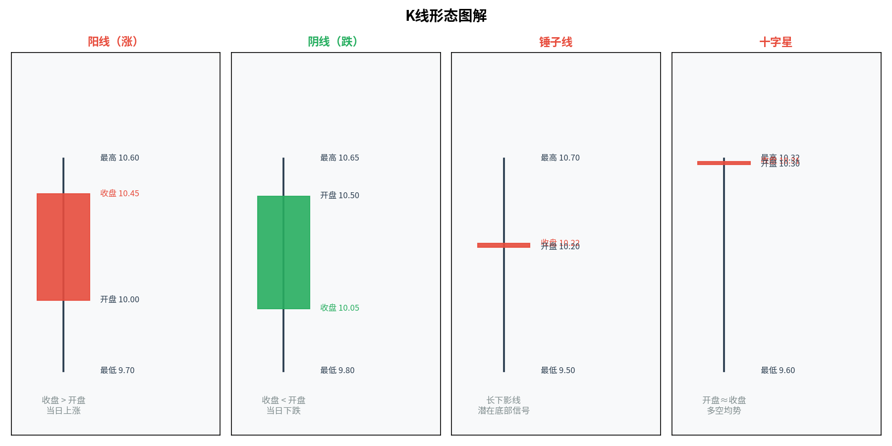
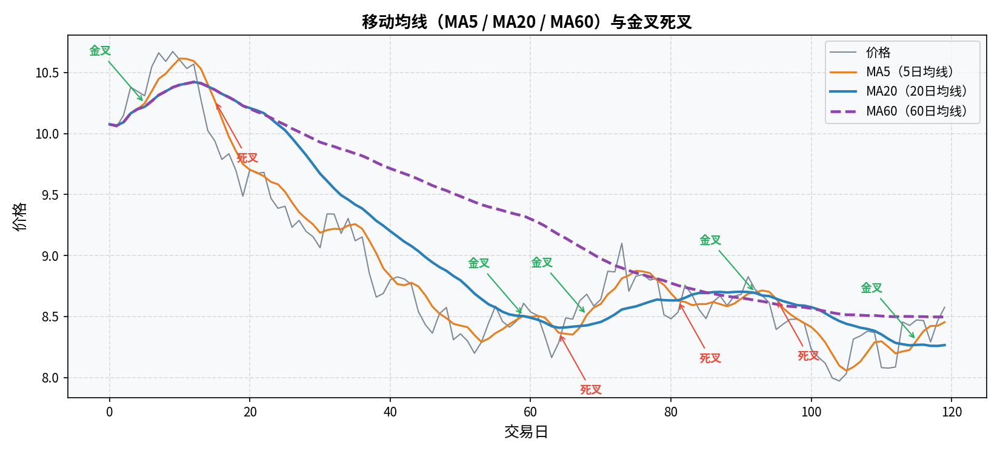
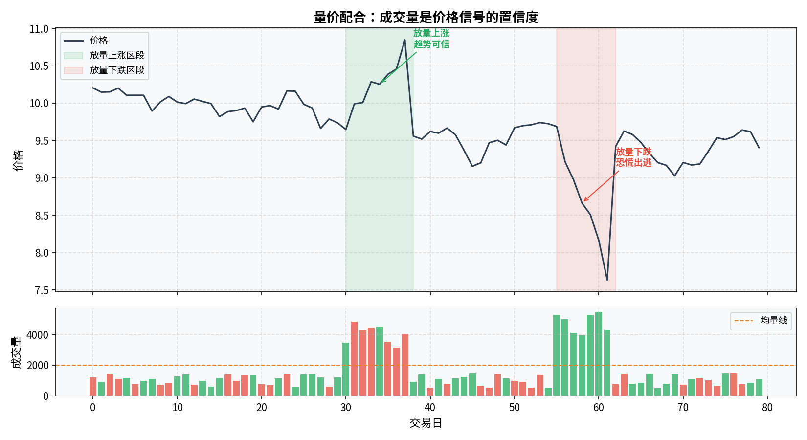
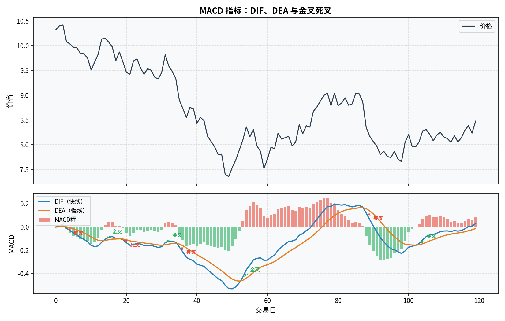
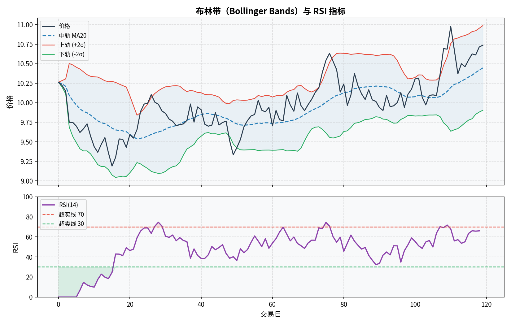
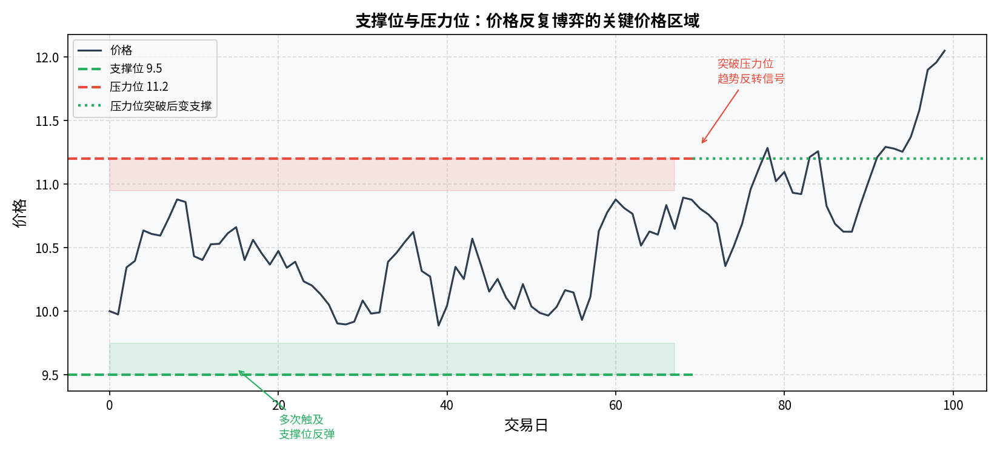

# 第六章：技术分析

> 技术分析不研究公司，只研究价格和成交量本身。它有用，也有局限，理性对待。

---

## 6.1 技术分析的前提假设与争议

技术分析（Technical Analysis）建立在三个假设上：

1. **市场行为包含一切信息**：所有公开的和内幕的信息都已经反映在价格中
2. **价格沿趋势运动**：价格一旦形成趋势，倾向于延续而非立刻反转
3. **历史会重演**：人类的贪婪与恐惧是恒定的，历史价格形态会重复出现

**争议**：

学术界的**有效市场假说（EMH）**认为，如果所有信息已反映在价格中，技术分析不可能持续获取超额收益——因为任何可预测的模式一旦被发现，就会被套利消除。

实践中，技术分析确实有一定效用，尤其在短期情绪驱动的市场（如 A 股）中，但其有效性高度依赖使用者的经验和纪律，且大量研究显示技术指标的胜率并不稳定。

**正确的态度**：把技术分析作为**辅助工具**，判断买卖时机；不要把它当成能预测未来的神器。基本面决定"值不值得买"，技术分析辅助决定"什么时候买"。

---

## 6.2 K 线图：读懂一根蜡烛的四个价格

K 线（Candlestick Chart）起源于日本江户时代的米市交易，是中日韩股市最主流的价格图表形式。

每一根 K 线代表一个时间单位（1 分钟、5 分钟、日、周……）内的价格变化，包含四个价格：

```
           │  ← 上影线（最高价到实体顶部的距离）
        ┌──┴──┐
        │     │  ← 实体（开盘价到收盘价之间）
        │  阳  │    实体为阳（红/空心）：收盘价 > 开盘价（上涨）
        │  线  │    实体为阴（绿/实心）：收盘价 < 开盘价（下跌）
        └──┬──┘
           │  ← 下影线（实体底部到最低价的距离）
```

**四个价格**：
- **开盘价（Open）**：该时间单位第一笔成交价
- **收盘价（Close）**：最后一笔成交价
- **最高价（High）**：该时段内的最高成交价
- **最低价（Low）**：该时段内的最低成交价

> 注意：中国 A 股习惯以**红色表示上涨**（阳线）、**绿色表示下跌**（阴线）。美股相反——绿色涨、红色跌。



---

## 6.3 常见 K 线形态

单根或组合 K 线形态有信号意义，以下是最常用的几种：

### 锤子线（Hammer）
```
    │  ← 极短上影线或无
   ═╪═
    │
    │  ← 长下影线（实体高度的 2 倍以上）
    │
```
出现在**下跌趋势末端**，下影线表明空方多次压低价格但被多方承接。是潜在底部反转信号。反方向（实体在下、长上影线）叫**吊颈线**，出现在上涨末端是顶部信号。

### 吞没形态（Engulfing）
由两根 K 线组成：
- **看涨吞没**：阴线之后跟着一根阳线，阳线实体完全覆盖阴线实体，出现在下跌趋势中，是反转信号
- **看跌吞没**：阳线之后跟着一根阴线，出现在上涨趋势中，是反转信号

### 十字星（Doji）
开盘价和收盘价几乎相同，实体极短，上下影线较长，形如十字。表明多空双方势均力敌，市场面临方向选择，通常预示趋势可能反转，需结合前后 K 线判断。

### 大阳线 / 大阴线
实体长、影线短。量价配合的大阳线（放量）是趋势延续或反转的强信号；连续大阴线放量通常是恐慌出逃。

---

## 6.4 趋势与均线

**趋势**是技术分析的核心概念之一：价格在一段时间内呈现出方向性的运动。

- **上升趋势**：一系列更高的高点（Higher High）和更高的低点（Higher Low）
- **下降趋势**：一系列更低的高点（Lower High）和更低的低点（Lower Low）
- **横盘整理**：高点低点无明显方向，价格在区间内震荡

### 移动平均线（Moving Average, MA）

把过去 N 天收盘价的平均值连成线，平滑价格噪音、显示趋势方向。

| 均线 | 参数 | 常见用途 |
|---|---|---|
| MA5 | 5 日均线 | 短期趋势，极为敏感 |
| MA10 | 10 日均线 | 短中期参考 |
| MA20 | 20 日均线（月线） | 中期趋势的核心参考线 |
| MA60 | 60 日均线（季线） | 中长期趋势 |
| MA120/MA250 | 半年线/年线 | 判断长期牛熊 |

**黄金交叉**：短期均线从下向上穿越长期均线，是做多信号（如 MA5 上穿 MA20）。
**死亡交叉**：短期均线从上向下穿越长期均线，是做空信号。

均线也有**支撑与阻力**的含义：价格经常在重要均线附近止跌（支撑）或止涨（阻力）。



---

## 6.5 成交量分析：量价配合的基本逻辑

**成交量**是价格信号的"置信度"。

核心原则：

| 量价关系 | 含义 | 信号 |
|---|---|---|
| 放量上涨 | 大量资金追进 | 趋势强势，可信度高 |
| 缩量上涨 | 无力推高，多方乏力 | 趋势较弱，警惕 |
| 放量下跌 | 大量筹码出逃 | 恐慌性抛售，趋势可能延续 |
| 缩量下跌 | 无量阴跌 | 多方护盘消极，分情况判断 |
| 缩量横盘后放量突破 | 积蓄能量后爆发 | 方向突破信号 |

**底部放量**：长期下跌后出现放量大阳线，通常是资金介入的信号，可能是阶段性底部。

**顶部放量**：长期上涨后出现超高成交量（俗称"天量"），可能是主力出货迹象。



---

## 6.6 常用技术指标

### MACD（移动平均收敛散度）

由三部分组成：
- **DIF 线（快线）**：12 日 EMA - 26 日 EMA
- **DEA 线（慢线）**：DIF 的 9 日 EMA
- **柱状图（MACD 柱）**：DIF - DEA，反映两线的距离

**使用方法**：
- DIF 上穿 DEA（金叉）→ 买入信号
- DIF 下穿 DEA（死叉）→ 卖出信号
- **背离**：价格创新高但 MACD 未创新高（顶背离），是见顶信号；反之为底背离



### RSI（相对强弱指数）

衡量一段时间内上涨幅度与总振幅的比值，数值在 0–100 之间。

- RSI > 70：超买，可能面临回调
- RSI < 30：超卖，可能面临反弹
- 在强趋势中，超买/超卖可以持续很久，不能单独作为反转信号

### 布林带（Bollinger Bands）

以 20 日均线为中轨，上下各加减 2 个标准差构成上轨和下轨。

- 价格靠近下轨且布林带收窄 → 可能反弹
- 价格突破上轨 → 上涨趋势强劲，或短期超买
- **布林带收窄**（带宽收窄）→ 即将出现方向性突破



---

## 6.7 支撑位与压力位

**支撑位（Support）**：价格在下跌过程中多次被接住、不再继续下跌的价格区域。

**压力位（阻力位，Resistance）**：价格在上涨过程中多次被压制、无法继续上涨的价格区域。

支撑和压力互相转换：一旦支撑位被有效跌破，它就变成了新的压力位（跌破变阻力）；反之亦然。



**形成支撑/压力的常见因素**：
- 重要均线（MA20、MA60）
- 整数关口（3000 点、4000 点）
- 前期高点或低点（历史成交密集区）
- 成本集中区（主力建仓区域）

---

## 6.8 技术分析的局限：不要迷信图表

几个必须清醒认识到的局限：

**1. 后视镜偏差**
K 线形态的名称和解读都是**事后**总结的。在实时图表上，同样的形态可能有多种解读，胜率远不如回测结果好看。

**2. 自我实现与失效**
技术分析的信号有一定自我实现性——大量人都知道某个形态是买入信号，形态出现时都去买，反而会推动价格上涨。但一旦机构知道散户的策略，会利用形态反向操作（"诱多"、"诱空"）。

**3. A 股的特殊性**
A 股存在大量散户，信息不对称严重，庄家行为干扰大，经典技术分析的有效性弱于机构为主的成熟市场。

**4. 技术指标滞后**
均线、MACD 等指标都基于历史数据计算，天然滞后于实际价格变动。

**正确使用技术分析的姿势**：
- 辅助确认趋势和时机，而非独立做出买卖决策
- 配合基本面分析使用
- 结合仓位管理和止损，不赌单一信号

---

## 本章小结

| 概念 | 核心要点 |
|---|---|
| K 线 | 记录开高低收四个价格，阳线涨阴线跌 |
| 均线 | MA20/MA60 是趋势判断核心，金叉死叉是方向信号 |
| 量价关系 | 放量上涨可信，缩量上涨乏力 |
| MACD | 金叉死叉 + 背离，最常用的趋势类指标 |
| 技术分析局限 | 后视镜偏差、滞后性、A 股信息不对称，不能单独依赖 |

---

**下一章** → [第七章：估值方法](chapter7.md)
