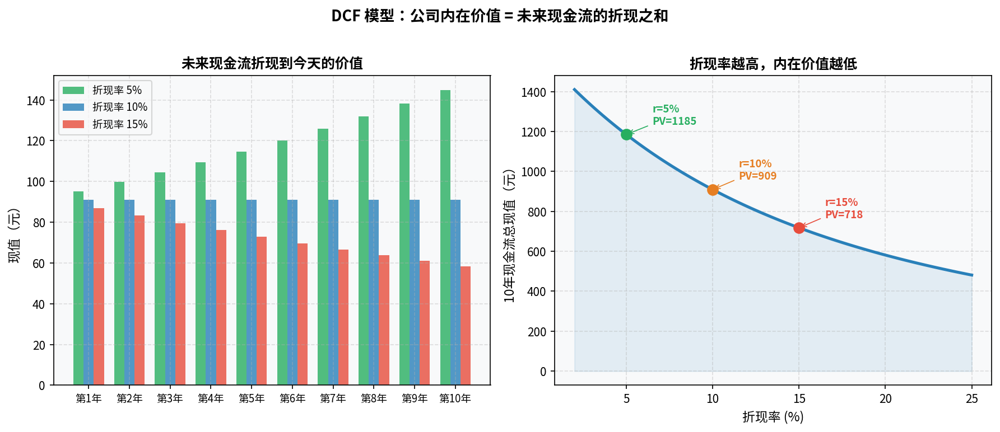

# 第七章：估值方法

> 技术分析告诉你"何时买"，估值告诉你"买的是否划算"。两者缺一不可。

---

## 7.1 绝对估值：DCF 模型的直觉理解

**DCF（Discounted Cash Flow，现金流折现）** 是最根本的估值方法，回答一个问题：这家公司未来所有的现金流，折算到今天值多少钱？

### 核心直觉

一棵果树值多少钱？取决于它未来每年能结多少果、果能卖多少钱、你还能卖多少年，以及果园离你多远（路途成本）。

股票的估值逻辑完全一样：

- 每年的"果"= 公司产生的自由现金流
- "还能卖多少年"= 公司存续年数
- "路途成本"= 折现率（反映风险和时间价值）

### 公式

$$V = \sum_{t=1}^{n} \frac{FCF_t}{(1+r)^t} + \frac{TV}{(1+r)^n}$$

- $FCF_t$：第 t 年的自由现金流
- $r$：折现率（通常用 WACC，加权平均资本成本）
- $TV$：终值（n 年后公司的永续价值估算）

### 对程序员的类比

把公司想象成一个不断产生输出的系统：

```
v = sum(fcf[t] / (1 + r) ** t for t in range(1, n+1)) + terminal_value / (1 + r) ** n
```

折现率 `r` 越高，未来现金流的现值越低——这反映了"未来的不确定性"。

### DCF 的局限

**对假设极度敏感**：折现率调 1%、增长率调 2%，估值结果可能差 50%。DCF 不是精确答案，而是一个**思维框架**，帮你想清楚"这家公司值多少"的逻辑。



巴菲特说他做心算 DCF，从不用电子表格——这是因为他在做的是数量级的判断，而不是精确计算。

---

## 7.2 相对估值：PE 估值法与 PB 估值法

绝对估值复杂、假设多，实践中更常用**相对估值**——把公司的估值倍数与同行业、与历史做比较。

### PE 估值法

**逻辑**：同等质量的公司应该交易在相近的 PE 水平。

步骤：
1. 获取公司的 EPS（每股收益）
2. 确定合理的 PE 倍数（参考同行、历史均值）
3. 合理股价 = EPS × 合理 PE

**示例**：
某消费品公司 EPS = 2 元，行业平均 PE = 25 倍，历史均值 PE = 22 倍。
合理估值区间：2 × 22 ~ 2 × 25 = 44 ~ 50 元。
若当前股价 38 元，存在安全边际，可能被低估。

**注意**：PE 估值的结果完全依赖于"合理 PE 倍数"的假设，而这个倍数本身是主观判断。

### PB 估值法

适合**银行、保险、地产**等重资产行业。

逻辑：公司的净资产是可以清算变现的，理论上公司市值不应该长期大幅低于净资产。

**PB < 1** 的股票俗称"破净股"，从理论上讲具有安全边际，但需要识别是否有商誉虚高、资产质量差等问题。

---

## 7.3 PEG：用增速修正 PE 的局限

PE 有一个明显缺陷：对增速不同的公司不公平。

一家 PE = 10 的公司，若利润在萎缩，并不便宜；
一家 PE = 30 的公司，若利润每年增长 40%，实际上可能很便宜。

**PEG（PE to Growth ratio）**= PE / 净利润增速（用百分比数值，不用小数）

- PEG < 1：可能被低估（为增长付的价格合理）
- PEG > 2：可能被高估
- PEG = 1：合理估值的经验分界线

**示例**：
PE = 30，净利润增速 = 30%，PEG = 30/30 = 1，基本合理。
PE = 30，净利润增速 = 10%，PEG = 30/10 = 3，偏贵。

PEG 由彼得·林奇（Peter Lynch）推广，适用于成长股。对周期股、低增速股意义有限。

---

## 7.4 EV/EBITDA：适合重资产公司的估值指标

**EV（企业价值）** = 市值 + 净负债（债务 - 现金）

**EBITDA** = 息税折旧摊销前利润，即剔除利息、税收、折旧和摊销之后的经营利润

**EV/EBITDA** 衡量以当前运营利润计算，多少年能回收买下整个公司的钱。

**为什么用这个指标？**

- 不同公司资本结构不同（有的高债务、有的净现金），PE 无法横向比较
- 折旧摊销的会计政策不同，EBITDA 比净利润更接近经营现金流
- 特别适合**资本密集行业**（航空、电信、矿业、有线电视）

**参考区间**：一般情况下 EV/EBITDA 在 8–12 倍为合理，低于 6 可能低估，高于 20 则需要高成长性支撑。行业差异显著，需对比同行。

---

## 7.5 估值的局限：模型假设的敏感性

所有估值方法都是工具，不是真理，使用时要清醒认识以下局限：

**1. 垃圾进，垃圾出**
估值模型的输出质量完全依赖输入假设。增长率、折现率、可持续年限——每一个参数都是主观判断。精确到小数点后两位的估值数字，往往给人一种虚假的确定性。

**2. 市场可以长期不理性**
凯恩斯说："市场保持非理性的时间，可以比你保持偿付能力的时间更长。"一只股票被你算出"低估 40%"，可能还会再跌 30%。估值是判断"值不值"，不是判断"何时涨"。

**3. 护城河假设**
DCF 和 PE 估值都隐含了公司未来能持续盈利的假设。如果护城河正在被侵蚀，所有估值都是无效的。

**4. 行业和时代的变迁**
传统零售的 PE 可能 10 倍，但电商替代之后，这个 PE 依然可能是贵的。行业结构性变化会让历史估值均值失效。

---

## 7.6 安全边际：巴菲特为什么要打折买入

**安全边际（Margin of Safety）** 是本杰明·格雷厄姆（Benjamin Graham）在《聪明的投资者》中提出的核心概念，也是巴菲特奉行终身的原则。

核心思路：**以低于内在价值的价格买入，折扣本身就是你的保护垫。**

为什么需要安全边际？

1. 你的估值可能是错的（模型误差）
2. 公司未来表现可能不如预期（执行风险）
3. 宏观环境可能恶化（系统风险）

安全边际的大小应该与不确定性正相关：

- 确定性极高的优质公司（如茅台在明显低估时）：20–30% 折扣即可
- 普通公司：30–50% 折扣
- 前景不明朗的公司：不买，不管看起来多便宜

格雷厄姆的量化标准（适合价值投资者参考）：
- PE < 15
- PB < 1.5
- PE × PB < 22.5

**安全边际不是精确的计算，而是一种保守主义的思维方式。**

---

## 本章小结

| 方法 | 适用场景 | 核心输入 |
|---|---|---|
| DCF | 稳定盈利的成熟公司 | 自由现金流预测 + 折现率 |
| PE 估值 | 盈利稳定的消费/工业公司 | EPS + 合理 PE 倍数 |
| PB 估值 | 银行、地产等重资产公司 | 净资产 + 合理 PB 倍数 |
| PEG | 高成长科技/消费公司 | PE + 净利润增速 |
| EV/EBITDA | 高负债/重资产行业 | 企业价值 + EBITDA |
| 安全边际 | 所有估值方法 | 内在价值估算 × 打折系数 |

---

**下一章** → [第八章：交易策略概览](chapter8.md)
