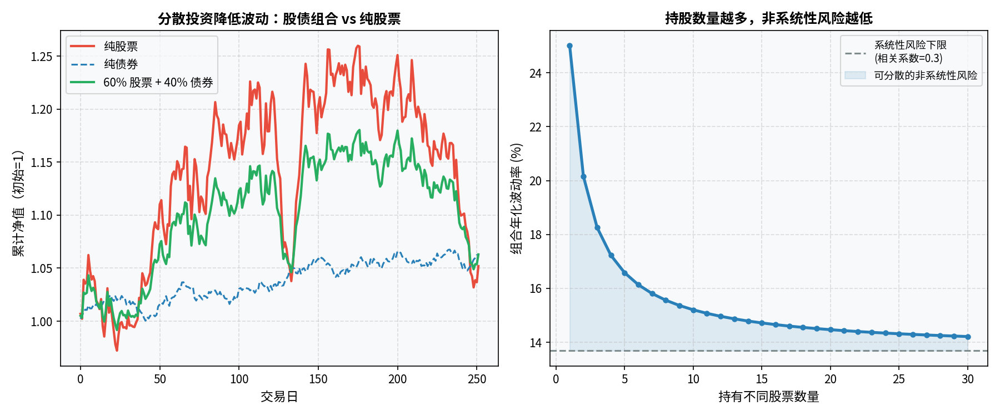

# 第九章：风险管理

> 在市场里活下去，比赚钱更重要。大多数人亏钱不是因为判断不准，而是因为一次大亏把本金打光了。

---

## 9.1 风险的分类

**系统性风险（Systematic Risk）**：整个市场共同承担的风险，无法通过分散消除。

- 宏观经济衰退
- 利率大幅上升
- 地缘政治冲突
- 全球性疫情

当股市整体崩溃时，无论你持有多少不同的股票，都会跌。

**非系统性风险（Unsystematic Risk）**：个别公司或行业特有的风险，可以通过分散投资降低。

- 公司财务造假
- 核心管理层离职
- 产品被颠覆性竞争者取代
- 行业政策突然收紧

**两类风险的启示**：

- 买单只股票，两类风险都有
- 持有 20+ 只不相关个股，非系统性风险大幅降低
- 持有宽基指数 ETF，非系统性风险几乎消除，只剩系统性风险

---

## 9.2 仓位管理：永远不要全仓

**仓位（Position Size）**指你用于投资的资金占总资产的比例。

**核心原则**：

1. **留有现金储备**：至少保留 3–6 个月的生活支出在货币基金，这部分钱永远不进股市
2. **不要全仓股票**：哪怕你极度看好，留 20–30% 的流动资金，理由是：你永远可能是错的，且市场底部时你需要有子弹加仓
3. **单只股票仓位控制**：一般建议单只股票不超过总投资组合的 20%，以防个股黑天鹅

**仓位分配思路（以 A 股个人投资者为例）**：

```
总资产 100 万
  └── 应急储备金 20 万（货币基金，永不动）
  └── 投资组合 80 万
        ├── 核心仓位（宽基 ETF）    40 万（50%）
        ├── 卫星仓位（精选个股）    30 万（37.5%）
        └── 机动资金                10 万（12.5%）
```

---

## 9.3 分散投资的数学：相关性与组合风险

分散投资的效果取决于资产之间的**相关性（Correlation）**。

- 相关性 = +1：两个资产完全同涨同跌，分散无效
- 相关性 = 0：两个资产走势完全独立，分散效果最大
- 相关性 = -1：一个涨另一个跌，完美对冲（实际中极少）

**实践中的分散维度**：

| 维度 | 举例 |
|---|---|
| 行业分散 | 同时持有金融、科技、消费、医药 |
| 市值分散 | 大盘蓝筹 + 中小盘成长 |
| 地域分散 | A 股 + 美股 + 港股 |
| 资产类别分散 | 股票 + 债券 + 黄金 |

**经典案例：股债组合**

历史上股票和债券的相关性较低甚至为负（股市下跌时资金往往流向债券避险）。持有 60% 股票 + 40% 债券的经典组合，在历次熊市中波动性显著小于纯股票组合，而长期收益仅略低。

**重要提示**：在极端危机时（如 2008 年金融危机、2020 年 3 月），几乎所有资产相关性都趋近于 1（一起跌），分散效果暂时失效。这时候，持有现金才是真正的避险。



---

## 9.4 止损：接受小损失、避免大亏损

**止损（Stop Loss）**：预先设定一个亏损上限，触及后无条件卖出。

止损的心理障碍：卖出就意味着承认错误，人类的**损失厌恶**天性会让你一直期待"再等等、可能会涨回来"——这是很多散户从小亏变成大亏的根本原因。

**止损的逻辑**：

你不知道自己是否判断正确。设置止损，是承认判断可能是错的，并限制错误的代价。

```
买入价：10 元
止损价：9 元（-10%）
目标价：13 元（+30%）

若止损：亏 10%
若达目标：赚 30%
赔率 = 3:1，只需胜率 > 25% 整体就能盈利
```

**常见止损方法**：

- **固定比例止损**：买入后跌 X%（如 7%–10%）止损，简单明了
- **技术位止损**：跌破关键支撑位（均线、前低）止损，更有逻辑依据
- **移动止损（Trailing Stop）**：随价格上涨动态调高止损价，锁定利润

**止损后的纪律**：止损之后，如果你的判断没有改变、但市场给出了更低的价格，可以重新入场。不要因为情绪拒绝再次出现的机会。

---

## 9.5 凯利公式：理性决定每笔交易投多少

**凯利公式（Kelly Criterion）** 给出数学上最优化长期财富增长的仓位比例：

$$f^* = \frac{bp - q}{b}$$

其中：
- $f^*$：最优仓位比例
- $b$：赔率（盈利与亏损的比值）
- $p$：获胜概率
- $q = 1 - p$：失败概率

**示例**：
- 你估计一笔交易胜率 60%，盈利/亏损比 = 2:1
- $f^* = (2 × 0.6 - 0.4) / 2 = 0.4 = 40\%$

**实践中的修正**：

全凯利仓位波动极大，实际操作中常用**半凯利**（最优仓位的一半）：
- 降低波动性
- 对概率和赔率估算错误的容错性更好

**对大多数散户的实际价值**：不是精确计算仓位，而是建立"胜率和赔率共同决定仓位"的思维框架。高确定性的机会可以重仓，不确定的机会要轻仓。

---

## 9.6 黑天鹅事件：历史上的极端行情

**黑天鹅（Black Swan）** 由纳西姆·塔勒布（Nassim Taleb）在《黑天鹅》中提出，指超出正常预期、极端罕见但影响巨大的事件。

历史上的典型案例：

| 事件 | 时间 | A 股/美股影响 |
|---|---|---|
| 互联网泡沫破裂 | 2000–2002 | 纳斯达克 -78% |
| 9/11 恐怖袭击 | 2001.09 | 美股停市 4 天后暴跌 |
| 全球金融危机 | 2008–2009 | 标普 500 -57%，A 股 -72% |
| 欧债危机 | 2010–2012 | 欧洲股市持续低迷 |
| A 股杠杆牛熊 | 2015.06–08 | 上证指数 3 个月跌 45% |
| 新冠疫情 | 2020.02–03 | 标普 500 33 天跌 34% |
| 俄乌冲突 | 2022.02 | 能源价格暴涨，欧股暴跌 |

**对投资者的启示**：

1. 黑天鹅无法准确预测，但可以对其有所准备
2. 永远不要满仓，要留出应对极端情况的空间
3. 不要使用杠杆，杠杆在黑天鹅事件中可能直接导致爆仓
4. 分散投资是应对黑天鹅的最有效手段

---

## 9.7 杠杆的双刃剑：融资融券、期权的风险

**杠杆**放大了收益，也等比例放大了亏损。

### 融资（Margin Trading）
向券商借钱买股票，通常可以借到总资金的 1–3 倍。

- 股票涨 10%，2 倍杠杆赚 20%（扣除利息）
- 股票跌 10%，2 倍杠杆亏 20%，接近**强制平仓线**（维保比例 130%）
- 继续跌 → 券商**强平**，你的损失锁定，无法等待反弹

2015 年 A 股牛市泡沫正是由场外配资（高达 5–10 倍杠杆）催生，泡沫破裂时大量散户遭遇连环爆仓。

### 期权
期权赋予你以固定价格买入或卖出股票的权利。

- 作为**对冲工具**：买入认沽期权，股票跌了也能盈利，相当于给持仓买保险
- 作为**投机工具**：裸买期权，最多亏完权利金（全损），但卖出期权的风险理论上无限

期权的时间价值衰减（Theta）会在到期日临近时加速，不了解期权定价原理不要轻易买卖。

**初学者守则**：在完全理解机制之前，不碰融资、不碰期货、不碰期权。

---

## 9.8 投资者心理偏误

行为金融学研究表明，人类的决策系统天然不适合金融市场。了解这些偏误，才能在出现时及时警觉。

### 损失厌恶（Loss Aversion）
亏损 1000 元的痛苦，大约是盈利 1000 元快乐的 2 倍。

**表现**：不愿意止损，把亏损股票一直拿着"等回本"，同时过早卖出盈利股票"落袋为安"。

**结果**：卖出了好票，留下了差票——组合越来越糟。

### 过度自信（Overconfidence）
大多数人认为自己高于平均水平，投资者尤其如此。

**表现**：过于频繁交易，认为自己能准确预测短期走势。统计上，交易越频繁的散户，长期收益越差。

### 锚定效应（Anchoring）
对某个参考点过度依赖。

**表现**：买入价就是"锚"——跌了就等回到买入价再卖，但买入价对股票未来走势毫无意义。

### 羊群效应（Herding）
跟随大众行动的倾向。

**表现**：牛市末期追涨、熊市底部恐慌出逃。绝大多数散户的操作时机恰好相反。

### 确认偏误（Confirmation Bias）
倾向于寻找支持自己已有观点的信息，忽略相反证据。

**表现**：买了一只股票后，只看利好分析，对利空信息选择性忽视。

**应对方法**：建立规则化的交易体系，用规则代替临场情绪决策。

---

## 本章小结

| 概念 | 核心要点 |
|---|---|
| 风险分类 | 系统性风险无法分散，非系统性风险可以通过多样化降低 |
| 仓位管理 | 保留应急储备，单股不超 20%，永不全仓 |
| 止损 | 预设亏损上限，无条件执行，是保存本金的最重要习惯 |
| 凯利公式 | 高确定性重仓，低确定性轻仓 |
| 杠杆 | 初学者禁区，强平风险在极端行情下会导致本金清零 |
| 心理偏误 | 损失厌恶、过度自信是散户亏钱的两大核心根源 |

---

**下一章** → [第十章：开户与实盘操作](chapter10.md)
